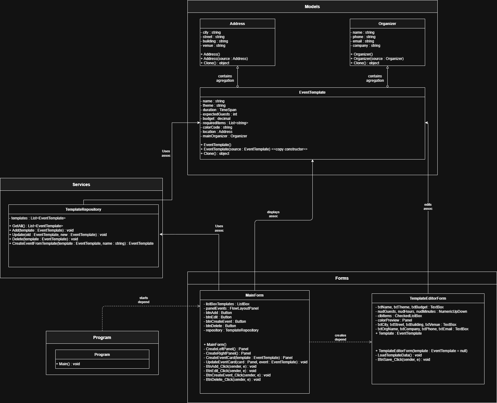

Диаграмма классов: 

Разница между приложениями с паттерном и без:

Использование Паттерна
public EventTemplate CreateEventFromTemplate(EventTemplate template, string eventName)
{
    var newEvent = new EventTemplate(template); // Клонирование!
    newEvent.Name = eventName;
    return newEvent;
}

---

Без паттерная
public EventTemplate CreateEventFromTemplate(EventTemplate template, string eventName)
{
    // Проблема 1: нужно вручную копировать КАЖДОЕ поле
    // Проблема 2: при добавлении нового поля придется менять этот метод
    // Проблема 3: легко ошибиться или забыть скопировать поле
    // Проблема 4: логика копирования размазана по коду

    return new EventTemplate
    {
        // Копирование простых полей
        Name = eventName,
        Theme = template.Theme,
        Duration = template.Duration,
        ExpectedGuests = template.ExpectedGuests,
        Budget = template.Budget,
        ColorCode = template.ColorCode,

        // Копирование списка (нужно создавать новый список)
        RequiredItems = new List<string>(template.RequiredItems),

        // ГЛУБОКОЕ КОПИРОВАНИЕ АДРЕСА - нужно создавать новый объект
        Location = new Address
        {
            City = template.Location?.City ?? "",
            Street = template.Location?.Street ?? "",
            Building = template.Location?.Building ?? "",
            Venue = template.Location?.Venue ?? ""
        },

        // ГЛУБОКОЕ КОПИРОВАНИЕ ОРГАНИЗАТОРА - новый объект
        MainOrganizer = new Organizer
        {
            Name = template.MainOrganizer?.Name ?? "",
            Phone = template.MainOrganizer?.Phone ?? "",
            Email = template.MainOrganizer?.Email ?? "",
            Company = template.MainOrganizer?.Company ?? ""
        }
    };
}